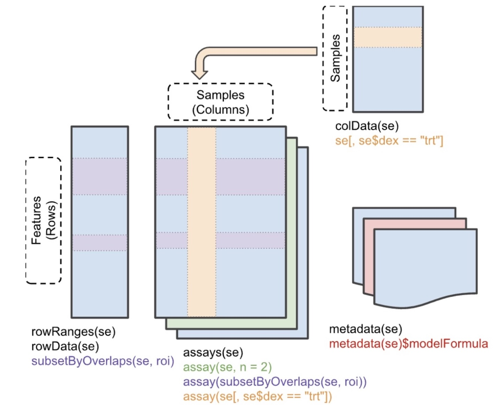
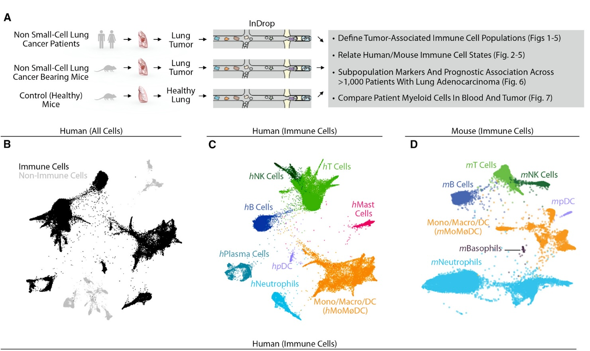

# Data structure concepts for genomic analysis

## Self-descriptive data structures

### Example: bulk RNA-seq analysis of smooth muscle treated with dexamethasone

See the [rnaSeqGene workflow](https://bioconductor.org/packages/release/workflows/vignettes/rnaseqGene/inst/doc/rnaseqGene.html) for a very
comprehensive treatment of the analysis of a designed
experiment, treating smooth muscle cells with
dexamethasone ([pubmed link to original study](https://pubmed.ncbi.nlm.nih.gov/24926665/).

### Example: Zilionis Single-Cell RNA-seq in lung

{width=5in}

The data are available in the Bioconductor [scRNAseq](https://bioconductor.org/packages/scRNAseq) package.

```{r setup,message=FALSE}
library(scRNAseq)
library(SingleCellExperiment)
library(ggplot2)
```
```{r getdat,cache=FALSE}
zil = ZilionisLungData()
```

```{r lkzil}
zil
```

#### Why is this "self-descriptive"?

"Mentioning" it to the R interpreter yields rich information
about the content

- Number of features measured
- Number of cells
- Sketch of feature and sample (cell) annotation
- Sketch of "dimension reduction" resources recorded
- optional metadata

As you work with the data structure, you can add content and
save to a checkpoint if desired.

#### Excursus: classes and methods

`zil` is an instance of the [SingleCellExperiment](https://bioconductor.org/packages/SingleCellExperiment) class.  This is derived from SummarizedExperiment,
and we will start with that.

{width=5in}

This data structure is designed to deal with the coordination
of multiple linked tables.  We'll use notation $G$ for the number of features assayed, $N$ to denote the number of samples assayed, and $R$ to denote the number of sample characteristics
recorded.  Each genomic feature may have $F$ metadata characteristics recorded. Typical components are

- assays: multiple $G \times N$ matrices of quantifications
- rowData: a $G \times F$ table of metadata about assayed
features; examples are gene or transcript identifiers and their addresses and functional characteristics
- colData: an $N \times R$ table of sample characteristics
- metadata: a list of elements characterizing general aspects of the experiment in some way

We can learn about methods for manipulating SummarizedExperiment instances via the `methods` function.  First, note
```{r chkcl}
class(zil)
is(zil, "SummarizedExperiment")
```

We say that `zil` inherits from SummarizedExperiment.
Ordinary R functions can be applied to `zil`, but Bioconductor's
approach uses ["S4 object-oriented programming"](https://adv-r.hadley.nz/s4.html) to
improve reliability and verifiability of operations with
SummarizedExperiment instances.  This means that a number
of computations of generic interest have been defined
as "S4 methods".  We can learn about them within R:

```{r lkmeth}
allm = methods(class="SummarizedExperiment")
grep("assay,", allm, value=TRUE)
```
This is telling us that the syntax `assay(zil)`
makes sense, and so does `assay(zil,1)` and
`assay(zil, "counts")`.

##### How does this represent useful binding of metadata to data?

We can easily learn about the "design" underlying the data
with some shortcuts:

```{r lkdes}
table(zil$Patient, zil$Tissue)
```

We can also quickly set up a visualization to confirm
connection with the publication.

```{r lkgr1}
library(ggplot2)
rd = as.data.frame(reducedDims(zil)[[3]])
rd = cbind(rd, type = zil$`Major cell type`)
rdp = na.omit(rd) # many cells not used
ggplot(rdp, aes(x=x, y=y, colour=type)) + geom_point(size=.5)
```

Compare the actual figure in the paper:

{width=5in}

Exercises

- Explain the following update to rd:
```
rd = cbind(rd, csf1r=assay(zil)["CSF1R",])
```
- Explain the result of `plot(y~x, data=rdp[rdp$csf1r>2,])`,
after updating `rd` as above and repeating the step that produced `rdp` from `rd` above.

